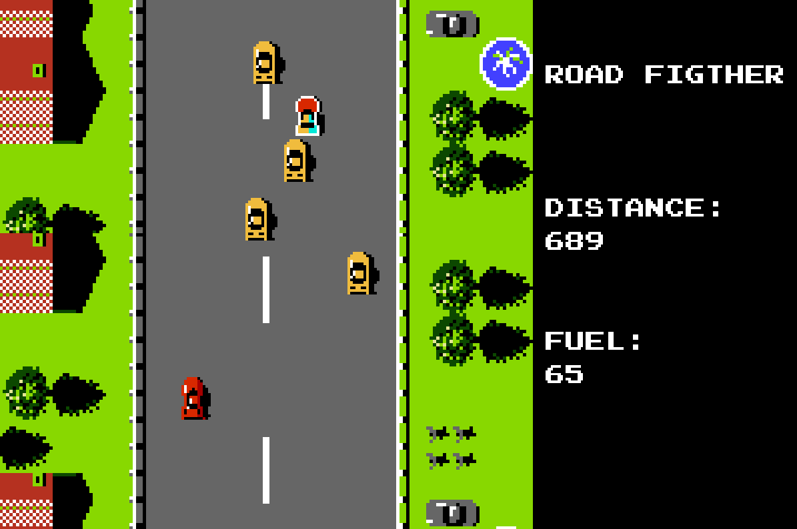

# road-fighter

Este é um projeto de desenvolvimento de uma versão endless do famoso jogo de NES, Road Fighter, utilizando a biblioteca Pygame. O objetivo do jogo é simples: o jogador precisa dirigir seu carro em uma estrada cheia de obstáculos e inimigos, evitando colisões e coletando pontos. A grande novidade desta versão é que o jogo não tem fim, ou seja, a estrada é gerada aleatoriamente e o jogador pode jogar indefinidamente. A jogabilidade é simples e intuitiva, com controles fáceis de aprender e um sistema de pontuação para manter a competitividade. A interface gráfica é baseada no estilo retro dos jogos de NES, com elementos simples e coloridos.

Este projeto é desenvolvido em Python e utiliza a biblioteca Pygame para renderização gráfica e tratamento de eventos de entrada. É um projeto de código aberto e está aberto a contribuições da comunidade. Se você é um fã do jogo Road Fighter ou de jogos retro em geral, fique à vontade para contribuir e ajudar a tornar este jogo ainda melhor! Também é importante destacar que todos os sprites do jogo foram desenhados manualmente no Photoshop, com base no layout original do jogo de NES. Essa é uma forma de manter a essência e fidelidade ao jogo original, além de adicionar um toque artístico e único à versão endless criada com Pygame. Cada sprite foi cuidadosamente criado para garantir uma experiência visual agradável e nostálgica para os fãs do jogo clássico.



# Comandos

| Comando  | Tecla |
| -------- | ----- |
| Start    | Enter |
| Acelerar | Z     |
| Sair     | ESC   |
| Esquerda | <-    |
| Direita  | ->    |

# Instalação

O jogo pode ser iniciado através do arquivo executável "play.exe", ou também instalado para ser executado pelo Python localmente.

``` python -m venv venv ```

Em primeiro lugar, "python -m venv venv" cria um novo ambiente virtual de Python com o nome "venv" (ou qualquer outro nome escolhido). Um ambiente virtual é um diretório que contém uma versão do interpretador Python, bem como as bibliotecas e dependências necessárias para o projeto. Isso permite que você isole o ambiente de desenvolvimento e evitar conflitos entre diferentes projetos que possam usar diferentes versões de bibliotecas ou Python.

``` pip install -r requirements.txt ```

O comando "pip" é o gerenciador de pacotes do Python e "install -r requirements.txt" indica que o pip deve instalar todas as dependências listadas no arquivo "requirements.txt". Esse arquivo contém a lista de pacotes e suas respectivas versões que são necessárias para o projeto funcionar corretamente.

``` python main.py ```

Com a instalação realizada no ambiente virtual ativado, é possível executar o jogo através do arquivo main e começar a jogar.
